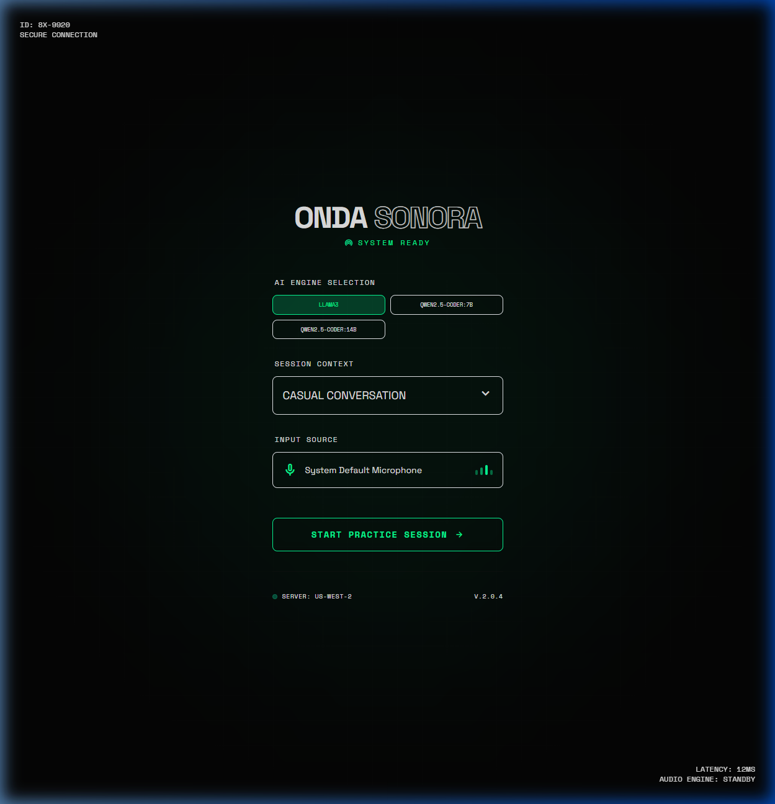
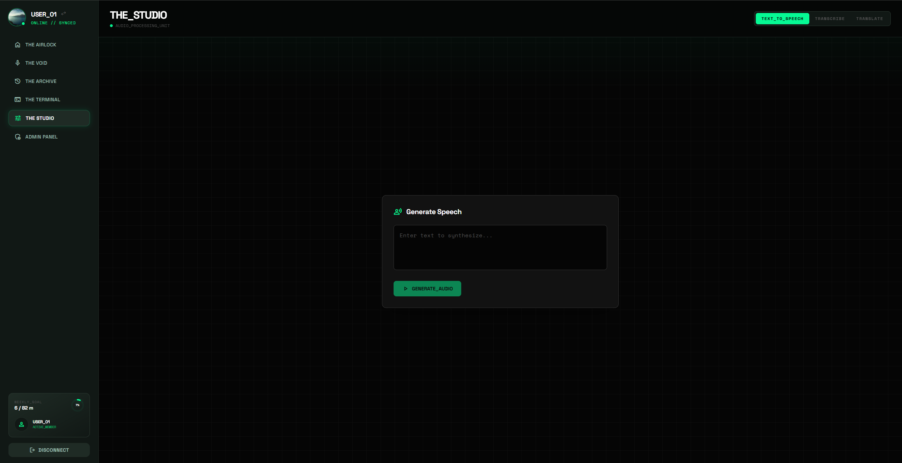
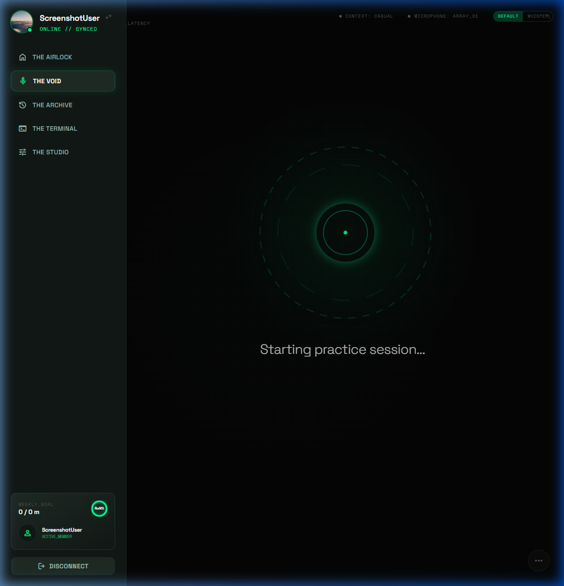
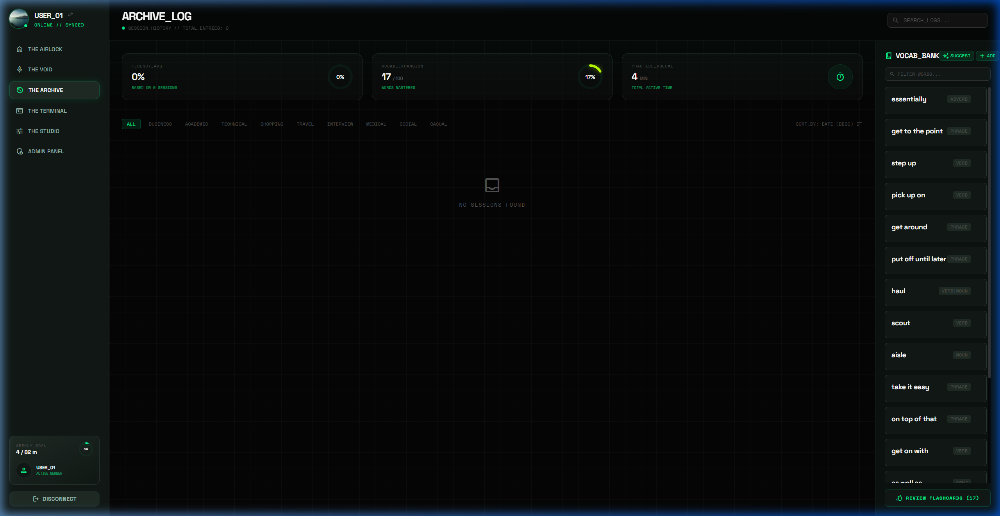
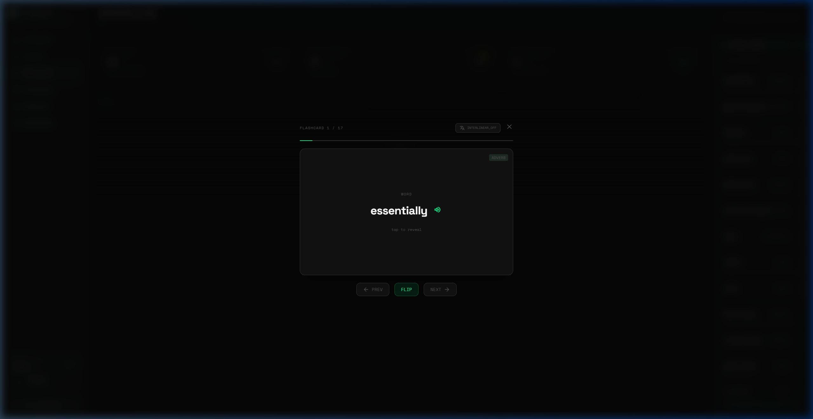

# 🌊 Onda Sonora

<div align="center">
  
  
  <p align="center">
    
    
    
    
    
    
    
  </p>

  **Domina un nuevo idioma con el poder de la IA local.**
</div>

---

## 📌 Índice

- [🚀 Sobre el Proyecto](#-sobre-el-proyecto)
- [✨ Características Principales](#-características-principales)
- [🛠️ Apartados de la App](#️-apartados-de-la-app)
- [🎙️ Integración de Voz (Whisper vs Default)](#️-integración-de-voz-whisper-vs-default)
- [💻 Ejecución en Local](#-ejecución-en-local)
    - [📋 Requisitos Previos](#-requisitos-previos)
    - [🤖 Configuración de Ollama](#-configuración-de-ollama)
    - [🤫 Configuración de Whisper-Server](#-configuración-de-whisper-server)
    - [🐧 Instrucciones para Linux](#-instrucciones-para-linux)
    - [🪟 Instrucciones para Windows](#-instrucciones-para-windows)
- [⚙️ Configuración Adicional](#️-configuración-adicional)

---

## 🚀 Sobre el Proyecto

**Onda Sonora** es una plataforma de aprendizaje de idiomas diseñada para ofrecer una experiencia inmersiva, moderna y completamente privada. Aprovechamos el poder de modelos **open-source** que se ejecutan directamente en tu máquina.

Lo que hace único a Onda Sonora es su arquitectura **Local-First AI**:
- **Ollama**: Orquestador de LLMs (como *llama3*) para análisis, traducción y conversación.
- **Whisper**: Transmisión de voz a texto de alta fidelidad ejecutada localmente.
- **Libertad Total**: Sin suscripciones, sin límites de tokens y sin comprometer tus datos.


---

## ✨ Características Principales

*   **Studio Translator**: Traductor bidireccional inteligente con contexto.
*   **Void Mode (Voice Practice)**: Sesiones de práctica oral en tiempo real con una IA que te escucha y responde.
*   **Linguistic Analysis**: Retroalimentación inmediata sobre errores de gramática, vocabulario y pronunciación.
*   **Flashcards Inteligentes**:
    *   Guarda palabras automáticamente desde tus sesiones.
    *   **Modo Interlineal**: Traducciones dinámica EN/ES mientras repasas.
    *   **Pronunciación**: Integración de síntesis de voz (TTS) para cada palabra.
*   **Context-Aware Learning**: Practica en 9 escenarios reales (Negocios, Viajes, Médico, etc.).
*   **Gestión de Vocabulario**: Banco de palabras con sugerencias impulsadas por IA.
*   **Interfaz Premium**: Diseño visualmente impactante con glassmorfismo y animaciones fluidas.

---

<div align="center">

### 🏠 Dashboard Principal
*Muestra de la vista general del usuario, metas y progreso.*  


### 🎨 Studio & Traductor
*Herramienta de traducción profesional con soporte de IA.*  


### 🎙️ Void Mode
*Interfaz de práctica oral en tiempo real.*  


### 🗂️ Flashcards & Archive
*Repaso espaciado y gestión de vocabulario.*  



</div>

---

## 🎙️ Integración de Voz (Whisper vs Default)

Onda Sonora ofrece dos modos de entrada de voz para adaptarse a tu hardware:

1.  **Modo DEFAULT**: Utiliza la API nativa del navegador (`Web Speech API`).
    - **Pros**: Funciona en cualquier equipo, no requiere configuración extra.
    - **Cons**: Requiere conexión a internet (en algunos navegadores) y es menos preciso con acentos.
2.  **Modo WHISPER**: Utiliza un servidor local de Whisper.
    - **Pros**: Precisión de nivel profesional, funciona 100% offline, detecta múltiples idiomas con fidelidad extrema.
    - **Cons**: Requiere más recursos (RAM/GPU).

> [!TIP]
> **¿No tienes potencia de cómputo suficiente?** No te preocupes, el proyecto funciona perfectamente en modo **DEFAULT** sin necesidad de correr Whisper-Server.

---

## 💻 Ejecución en Local

### 📋 Requisitos Previos

*   **Node.js** (v18 o superior)
*   **Python** (v3.12 o superior)
*   **Ollama** (Servicio de IA local)

### 🤖 Configuración de Ollama

1.  **Descargar Ollama**: [ollama.com](https://ollama.com)
2.  **Modelos necesarios**: Ejecuta los siguientes comandos en tu terminal:
    ```bash
    ollama pull llama3
    ```

### 🤫 Configuración de Whisper-Server

Para habilitar el modo **Whisper** en la app, necesitas un servidor compatible con la API de OpenAI corriendo en el puerto 8080.

#### 🐧 Instalación en Linux (Recomendado: whisper.cpp)
1.  **Clonar y compilar**:
    ```bash
    git clone https://github.com/ggerganov/whisper.cpp.git
    cd whisper.cpp
    make server
    ```
2.  **Descargar modelo base**:
    ```bash
    bash ./models/download-ggml-model.sh base.en
    ```
3.  **Ejecutar servidor**:
    ```bash
    ./server -m models/ggml-base.en.bin --port 8080
    ```

#### 🪟 Instalación en Windows
Puedes usar el ejecutable precompilado de `whisper.cpp` o usar una alternativa en Python:
1.  **Instalar via Python**:
    ```powershell
    pip install openai-whisper uvicorn fastapi python-multipart
    ```
2.  **Descargar un wrapper de servidor** (o configurar uno que exponga `/inference` en el puerto 8080).
3.  **Ejecutar**: Asegúrate de que el servidor escuche en `http://127.0.0.1:8080/inference`.

> [!IMPORTANT]
> **Requerimientos de Whisper**: Se recomienda al menos 8GB de RAM. Si tienes una GPU NVIDIA, asegúrate de tener instalados los drivers de CUDA para un rendimiento instantáneo.

---

### 🐧 Instrucciones para Linux

1.  **Clonar el repositorio:**
    ```bash
    git clone https://github.com/dwDeez/Onda-Sonora-Whisper.git
    cd Onda-Sonora-Whisper
    ```

2.  **Configurar el Backend:**
    ```bash
    python3 -m venv ondasonora
    source ondasonora/bin/activate
    cd backend
    pip install -r requirements.txt
    uvicorn main:app --port 8000 --reload
    ```

3.  **Configurar el Frontend (en otra terminal):**
    ```bash
    npm install
    npm run dev
    ```

---

### 🪟 Instrucciones para Windows

1.  **Clonar el repositorio:**
    ```powershell
    git clone https://github.com/dwDeez/Onda-Sonora-Whisper.git
    cd Onda-Sonora-Whisper
    ```

2.  **Configurar el Backend:**
    ```powershell
    python -m venv ondasonora
    .\ondasonora\Scripts\activate
    cd backend
    pip install -r requirements.txt
    # Opcionalmente, instala uvicorn si no está en requirements
    pip install uvicorn fastapi pydantic
    uvicorn main:app --port 8000 --reload
    ```

3.  **Configurar el Frontend (en otra terminal):**
    ```powershell
    npm install
    npm run dev
    ```

---

## ⚙️ Configuración Adicional

Asegúrate de tener un archivo `.env` en la raíz (puedes usar `.env.example` como base). Verifica que el backend apunte correctamente a la instancia de Ollama (por defecto `http://localhost:11434`).

---

<div align="center">
  <p>Creado con ❤️ para el aprendizaje de idiomas.</p>
</div>